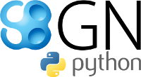

Documentation for libsbgn-python
================================

Source code and support are available at
`https://github.com/matthiaskoenig/libsbgn-python
<https://github.com/matthiaskoenig/libsbgn-python>`_.

.. toctree::
    :numbered:
    :maxdepth: 3

    introduction
    examples
    libsbgnpy

Indices and tables
==================

* :ref:`genindex`
* :ref:`modindex`
* :ref:`search`
